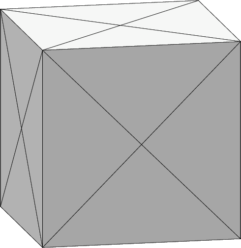
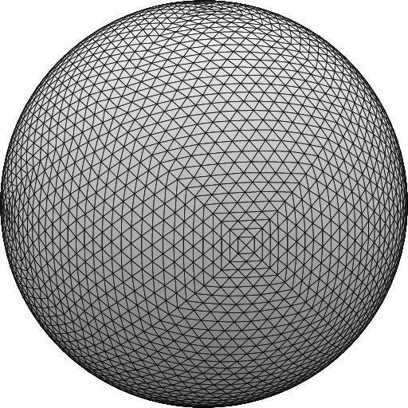

# minimal surface of cube

First experiment.  
Different way to generate sphere from cube from cube.fe in tutorial.  
Instead of surface tension, I gave square mean curvature as energy.  
(no gravity, no surface tension)  

Initial shape  


Iteration steps for minimal\_surface\_cube.fe. (after twice gogo)  
```evolver
Enter command: gogo
  5. area:  4.85576531233099 energy:  12.7128217428886  scale: 0.00960726
  4. area:  4.85576400709695 energy:  12.7128018004590  scale: 0.00147341
  3. area:  4.85576166982132 energy:  12.7127922272292  scale: 0.00304965
  2. area:  4.85576053467470 energy:  12.7127835774796  scale: 0.00136663
  1. area:  4.85575838805523 energy:  12.7127752975995  scale: 0.00284633
Vertices: 770  Edges: 2304  Facets: 1536  Bodies: 1  Facetedges: 4608
Element memory: 720 KB, or 0 MB
Total data memory: 5246 KB, or 5 MB.
  5. area:  4.84388704091141 energy:  13.5441961941423  scale: 0.000521942
  4. area:  4.84230644261966 energy:  12.8884291490120  scale: 0.000293785
  3. area:  4.84174944230864 energy:  12.7242654808258  scale: 0.000407361
  2. area:  4.84158201322272 energy:  12.6646429462631  scale: 0.000302450
  1. area:  4.84148682323599 energy:  12.6406728373079  scale: 0.000420296
  1. area:  4.84103881720429 energy:  12.6087864110725
Vertices: 3074  Edges: 9216  Facets: 6144  Bodies: 1  Facetedges: 18432
Element memory: 2880 KB, or 2 MB
Total data memory: 7505 KB, or 7 MB.
  5. area:  4.83781511704221 energy:  13.3609259921390  scale: 0.000142751
  4. area:  4.83745930026285 energy:  12.7831968313847  scale: 7.96228e-05
  3. area:  4.83735666925053 energy:  12.6604466365980  scale: 9.95579e-05
  2. area:  4.83732536022851 energy:  12.6157222491484  scale: 7.41476e-05
  1. area:  4.83730944655515 energy:  12.5982244686849  scale: 9.87078e-05
  1. area:  4.83725209083054 energy:  12.5809153572794
Enter command: v
Body          target volume           actual volume          pressure
  1                       1        1.00000000000103 0.0137164001650389

            Quantity       target value           actual value                 pressure
               spsmc         ---------            12.5760781051886
```
generated image  


Iteration steps for cube.fe. (after twice gogo)  
```evolver
Enter command: gogo
  5. area:  4.85427595116691 energy:  4.85427595116691  scale: 1.00000
  4. area:  4.85411618724338 energy:  4.85411618724338  scale: 1.00000
  3. area:  4.85398634437680 energy:  4.85398634437680  scale: 1.00000
  2. area:  4.85394467514070 energy:  4.85394467514070  scale: 0.307786
  1. area:  4.85390616386007 energy:  4.85390616386007  scale: 0.314276
Vertices: 770  Edges: 2304  Facets: 1536  Bodies: 1  Facetedges: 4608
Element memory: 720 KB, or 0 MB
Total data memory: 1910 KB, or 1 MB.
  5. area:  4.84097860660714 energy:  4.84097860660714  scale: 0.230032
  4. area:  4.84065740195640 energy:  4.84065740195640  scale: 0.181529
  3. area:  4.84061937300778 energy:  4.84061937300778  scale: 0.274263
  2. area:  4.84060237884398 energy:  4.84060237884398  scale: 0.252018
  1. area:  4.84058919727155 energy:  4.84058919727155  scale: 0.287692
  1. area:  4.84052772545159 energy:  4.84052772545159
Vertices: 3074  Edges: 9216  Facets: 6144  Bodies: 1  Facetedges: 18432
Element memory: 2880 KB, or 2 MB
Total data memory: 4168 KB, or 4 MB.
  5. area:  4.83720839637238 energy:  4.83720839637238  scale: 0.230558
  4. area:  4.83713668924354 energy:  4.83713668924354  scale: 0.179443
  3. area:  4.83713153557619 energy:  4.83713153557619  scale: 0.236682
  2. area:  4.83713007451583 energy:  4.83713007451583  scale: 0.239688
  1. area:  4.83712909153659 energy:  4.83712909153659  scale: 0.266560
  1. area:  4.83712045212648 energy:  4.83712045212648
Enter command: v
Body          target volume           actual volume          pressure
  1                       1        1.00000000000006  3.22472546899367
```
generated image  



looks like same but energy convergence of minimal\_surface\_cube.fe looks slower. (or should I look scale factor?)  

