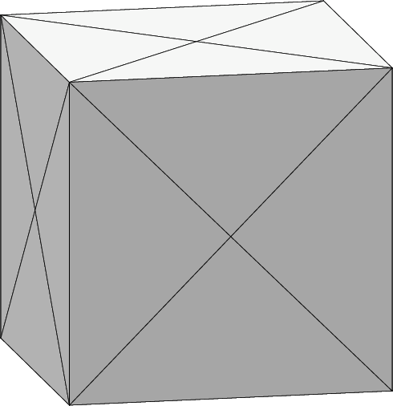
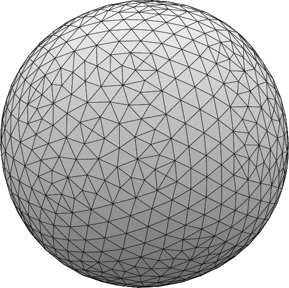

# Bending Curvature model (BC model)

Simulating BC model to determin the shape of vesicle.  
NO gravitation, NO surface tension.  
Parameters to determine the shape of vesicle are  
1: reduced volume ($v$)
```math
v = 6\sqrt \pi  \displaystyle \frac{V}{A^{3/2}}
```  
V...volume
A...surface area


2: area difference ($\Delta a$)
```math
\Delta a = \displaystyle \frac{\int HdA}{2 \sqrt \pi A^{1/2}}
```
H...mean curvature


Under constraints that these two parameters are given a certain value,
its shape is obtained by minimize bending energy.
```math
2k \int H^2 dA
```
Here, k is bending modulus but neglected in evolver calculation.


At first, we set $v = 1.0$ and $\Delta a = 1.0$ (perfect sphere)
and initial shape is cube (copied from cube.fe).


we fixed surface area as initial value (cube so 6.0)
and change volume calculated from reduced volume.

after typical evolution command,  
```evolver
r 3; {g 3; u 3; V}5
```
we got the shape as below  


we get energy as below.  
```evolver
  3. area:  6.00925576303755 energy:  13.3770803009363  scale: 0.000263792
WARNING 1055: Volume or quantity constraints don't converge in 10 projections.
Total difference 55.0908 times tolerance

  2. area:  6.00997447786646 energy:  13.6712550782344  scale: 0.00000
WARNING 1055: Volume or quantity constraints don't converge in 10 projections.
Total difference 209.797 times tolerance

  1. area:  6.00733697319516 energy:  12.7327272098020  scale: 0.00000
```

final values for quantities were,
```evolver
Body          target volume           actual volume          pressure
  1            ------------           1.38197463994072 

            Quantity       target value           actual value                 pressure
               spsmc         ---------            12.7257613172863
              f_area                       6        6.00733570408749   500.736641907475
                 vol        1.38197659788534        1.38197463994072  -1282.46552499374
                 mcu                       1        1.00147014236513  -696.509013940986
```

